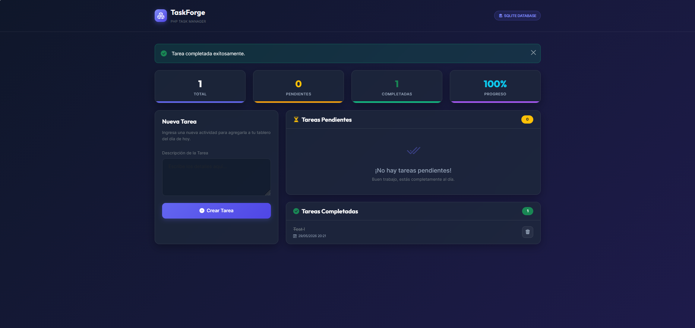

# TaskForge – PHP Task Manager

[](https://www.php.net/)
[](https://www.gnu.org/licenses/agpl-3.0)
[](https://github.com/johnyse99/taskforge)
[](https://phpunit.de/)

---

## 📌 Overview
TaskForge is a lightweight **Task Manager** built with PHP.  
It is designed as a simple yet structured project to demonstrate clean architecture principles and provide a foundation for experimenting with modular development.

---

---


---

## ✨ Features
- **Create tasks** with description and status  
- **List tasks** in a clean interface  
- **Mark tasks completed** or delete them  
- **Store tasks** in SQLite (default) or JSON file  
- **Responsive UI** using Bootstrap  

---

## ⚙️ Tech Stack
- **Language:** PHP 8.x  
- **Database:** SQLite (via PDO) or JSON fallback  
- **UI:** HTML5 + Bootstrap  
- **Testing:** PHPUnit  

---

## 🚀 Installation
1. Clone the repository:
   ```bash
   git clone https://github.com/johnyse99/taskforge.git
   cd taskforge
   ```

2. Start PHP’s built-in server:

php -S localhost:8000

3. Open in browser:  
  ```
  http://localhost:8000

  ```

---

## 📂 Project Structure
```
/src
  /Domain
    Task.php
    TaskStatus.php
  /Application
    TaskService.php
  /Infrastructure
    TaskRepositorySQLite.php
    TaskRepositoryJSON.php
  /Interface
    TaskController.php
    views/
index.php

```

## 🧪 Testing
composer install
php vendor/bin/phpunit

---
## 📖 Documentation

See docs/specifications/technical_specs.md for detailed architecture, bounded contexts, and technical specifications.
Additional diagrams are available in docs/architecture/.

---

## 📜 License
This project is licensed under the GNU Affero General Public License v3.0 (AGPL-3.0).
See the LICENSE file for details.

**Note for recruiters:**
This project demonstrates my ability to design and implement complex systems using professional standards. It highlights my mastery of transactional integrity, clean architecture, and the development of resilient software capable of handling real-world failure scenarios.

**Author:** JUAN S.  
**Contact:** https://github.com/johnyse99

---